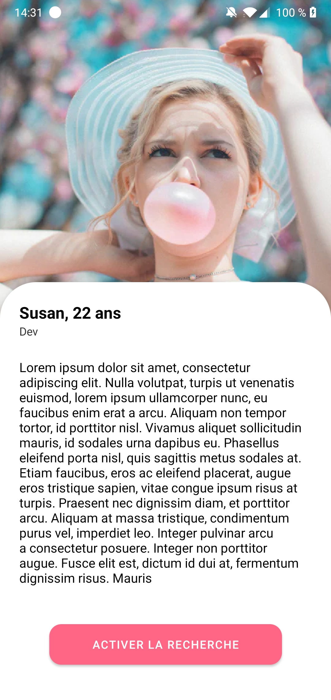
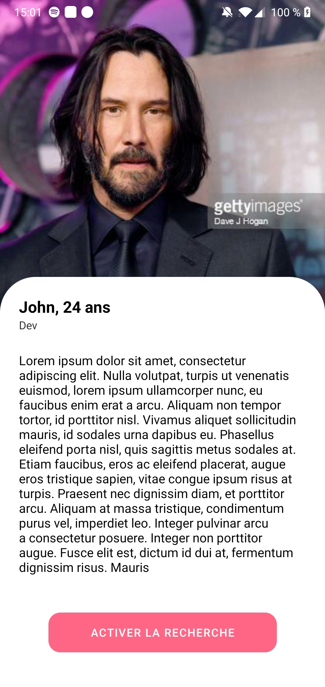
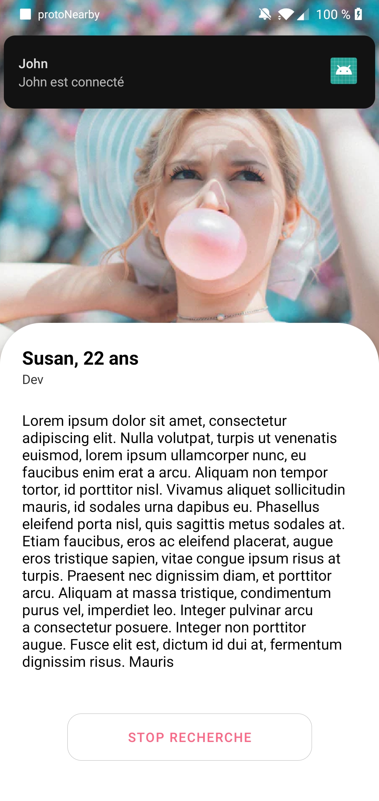

<p align="center">
  <h2 align="center">ProtoNearby</h2>
</p>




Example of a ReactNative project with an async Google Nearby Messages API Wrapper (https://github.com/SquirrelMobile/react-native-google-nearby-messages) for React Native (Android & iOS), supporting autolinking, custom discovery modes (broadcast, scan, ..), custom discovery mediums (bluetooth, audio, ..), awaitable native invokations and React hooks!

## Install

Add your generated API Key and Permissions to your AndroidManifest.xml:

```
<application >
    ...
    <meta-data
        android:name="com.google.android.nearby.messages.API_KEY"
        android:value="API_KEY" />
    ...
</application>
```

And in connect function in NearByContext.js

```
 const _connect = async () => {
    await connect({
      apiKey: 'API_KEY',
      discoveryMediums: ['ble'],
      discoveryModes: ['broadcast'],
    });
    console.log('Connected!');
  };
```
